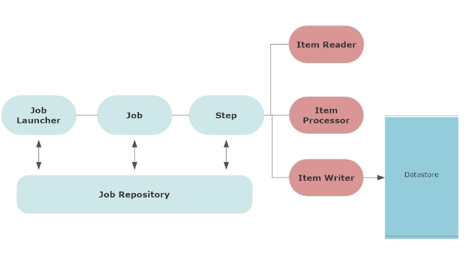
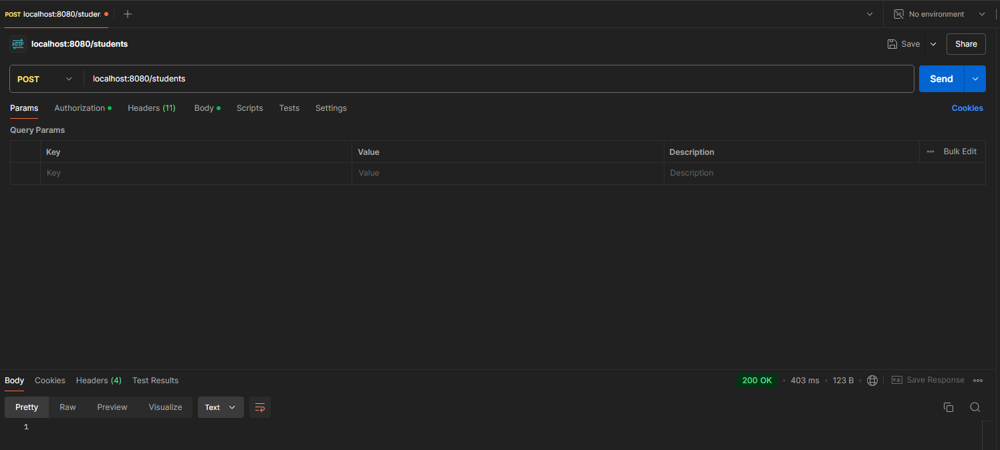

# Spring Batch Demo




## Overview

This project demonstrates how to use Spring Batch to read data from a CSV file, process it, and save it to a database. The specific use case is to import student records from a CSV file, transform the `firstname` and `lastname` fields to uppercase, and save these records into a database.

## Components

### Spring Batch

Spring Batch is a lightweight framework for batch processing. It provides tools for reading, processing, and writing data in batch jobs. This project uses Spring Batch to:

- **Read**: Load data from a CSV file.
- **Process**: Transform the data (e.g., convert names to uppercase).
- **Write**: Save the processed data to a database.

### Project Structure

1. **Batch Configuration (`BatchConfig.java`)**
    - **Item Reader**: Reads data from the CSV file.
    - **Item Processor**: Processes the data (e.g., transforms the names to uppercase).
    - **Item Writer**: Writes the processed data to the database.
    - **Job and Step Definitions**: Configures the job and its steps.

2. **Item Processor (`StudentProcessor.java`)**
    - Contains the business logic to process student records.

3. **Entity (`Student.java`)**
    - Represents the student record with fields: `id`, `firstname`, `lastname`, and `age`.

4. **Controller (`StudentController.java`)**
    - Provides an endpoint to trigger the batch job via HTTP POST request.

## How It Works

1. **CSV Reading**: The `FlatFileItemReader` reads data from `students.csv` located in `src/main/resources`. The CSV file is expected to have headers: `id`, `firstname`, `lastname`, and `age`.

2. **Data Processing**: The `StudentProcessor` transforms the `firstname` and `lastname` fields to uppercase.

3. **Data Writing**: The `RepositoryItemWriter` saves the processed `Student` records to the database.

4. **Job Execution**: The batch job is triggered via a POST request to the `/students` endpoint, which initiates the import process.

## Setup and Run

1. **Dependencies**: Ensure you have the necessary dependencies for Spring Batch and your database configured in your `pom.xml`.

2. **Database Configuration**: Configure your database connection in `application.properties`.

3. **CSV File**: Place your CSV file (`students.csv`) in `src/main/resources`.

4. **Run the Application**: Start your Spring Boot application.

5. **Trigger Batch Job**: Send a POST request to `http://localhost:8080/students` using Postman to start the batch job.



## Example CSV

Here is an example of what the `students.csv` file should look like:

```csv
id,firstname,lastname,age
1,John,Doe,20
2,Jane,Smith,22
3,Jim,Brown,19
```


## Notes

- Ensure your database is running and accessible.
- The batch job processes records in chunks of 10. Adjust the chunk size in  (`BatchConfig`)  as needed.
- Error handling and transaction management are configured to ensure reliable job execution.


